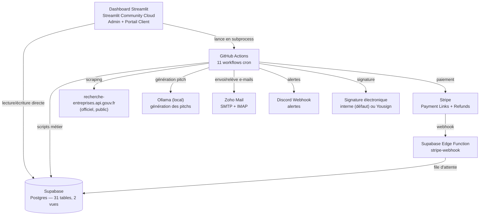

# Expertise Digitale — Dossier de présentation

*Document généré à partir d'une analyse complète du code source, du schéma Supabase, des scripts d'automatisation et des fichiers de configuration du dépôt `leads-creator`. Toute affirmation ci-dessous est vérifiable dans le dépôt ; les points non tranchés (statut légal, tarifs définitifs) sont signalés comme tels plutôt qu'inventés. Remplace la version du 26/07/2026, dont le modèle économique et l'architecture technique décrits ne correspondent plus au système actuel.*

---

## 1. Résumé exécutif

**Expertise Digitale** exploite deux moteurs commerciaux distincts, tous deux ciblant le secteur du Bâtiment (BTP) :

1. **Marketplace de leads B2C** : des particuliers déposent une demande de devis (formulaire public) ; le système la rapproche automatiquement d'un artisan client (abonné ou payant à l'unité) dont le corps de métier et la zone d'intervention correspondent, en round-robin. L'artisan reçoit le contact du particulier dès livraison (abonnement) ou après paiement d'un lien Stripe à usage unique (à l'unité).
2. **Plateforme outbound B2B multi-clients** (`outbound_chantiers/`) : pour le compte de clients (agences, entreprises du BTP), le système source des acteurs professionnels (architectes, promoteurs, maîtres d'œuvre) actifs sur des chantiers récents (signal d'activité via données d'urbanisme publiques), les enrichit, les scoreet les contacte par campagne — chaque client a sa propre configuration (secteur, communes ciblées, types d'acteurs).

Les deux moteurs partagent la même infrastructure d'envoi (boîte Zoho, budget de warmup) et le même arrière-plan technique (Supabase, dashboard Streamlit, automatisations GitHub Actions).

> **Changement de modèle depuis la version précédente de ce dossier (26/07/2026)** : l'offre "site vitrine Done For You à 990 € TTC" a été abandonnée. Le système ne vend plus de site vitrine ni de fichiers CSV en vrac — il vend des leads qualifiés, livrés en continu, sur abonnement ou à l'unité.

---

## 2. Modèle économique

### 2.1 Offre B2C — vente de demandes de devis aux artisans

| Formule | Détail | Où c'est implémenté |
|---|---|---|
| **À l'unité** | Prix variable selon la qualité du lead (score 0-100 calculé par `scorer_leads.py`) : **Basique 30 €**, **Standard 45 €**, **Premium 65 €**. Le particulier n'est révélé qu'après paiement (lien Stripe à usage unique). | `generation_contrats.py::palier_pour_score/prix_lead_unite_eur`, `livraison_devis.py::_proposer` |
| **Abonnement mensuel** | Volume inclus, livraison directe sans paiement supplémentaire : **Petit 420 €/mois (10 leads)**, **Moyen 760 €/mois (20 leads)**, **Grand 990 €/mois (30 leads)**. Quota suivi sur le cycle de facturation réel (ancré sur la date de premier paiement Stripe). | `generation_contrats.py::FORMULES_ABONNEMENT`, `livraison_devis.py::_livrer_directement` |

> Valeurs actuellement en vigueur dans l'environnement de production (confirmées en base le 04/09/2026), mais toujours qualifiées de **placeholder** dans le code lui-même (`generation_contrats.py`) — montants définitifs non figés par l'agence, à ajuster avant tout engagement commercial à grande échelle.

Aucun paiement récurrent réel : les abonnements sont des Payment Links Stripe à usage unique, reconduits manuellement — le projet n'enregistre aucune carte bancaire.

Zone couverte (sourcing des artisans clients potentiels) : **Métropole de Lyon** (Lyon 1er-9e + Villeurbanne, Vénissieux, Saint-Priest, Bron, Vaulx-en-Velin, Caluire-et-Cuire, Oullins-Pierre-Bénite, Rillieux-la-Pape, Écully) **et zone Grand Est** (Reims, Strasbourg, Metz, Nancy, Troyes, Mulhouse, Colmar, Charleville-Mézières) — voir `scraper_batiment.py::VILLES_CIBLES`.

### 2.2 Offre B2B — sourcing d'acteurs pro pour le compte de clients

Plateforme multi-clients/multi-secteurs (table `campagnes`) : chaque client (ex. une entreprise du BTP cherchant des prescripteurs) définit ses communes cibles et types d'acteurs recherchés. Le système source, enrichit (contact réel) et contacte ces acteurs, avec relance automatique (J+3, J+7).

| Type d'acteur | Prix indicatif | 
|---|---|
| Architectes | 70 €/lead |
| Promoteurs immobiliers | 60 €/lead |
| Maîtres d'œuvre | 50 €/lead |

Grille indicative uniquement (`generation_contrats.py::GRILLE_PRIX_PAR_TYPE_ACTEUR_EUR`) — le prix réel est **saisi à la main** sur chaque bon de commande, jamais calculé automatiquement (permet une remise négociée ou un palier de volume sans changer le code).

Un outil legacy (`export_leads_commerciaux.py`, export CSV brut avec/sans email vérifié) existe encore mais n'est plus l'offre B2B principale — la plateforme de campagnes ci-dessus l'a remplacé.

### 2.3 Tunnel de conversion réel (B2C)

```
Scraping SIRENE (public, officiel) — artisans potentiels, zone Lyon + Grand Est
      ↓
Vérification email/téléphone réels (anti-bounce, anti-homonyme)
      ↓
Génération pitch personnalisé (IA locale, Ollama) — RÉGÉNÉRÉ à chaque envoi
      ↓
Envoi e-mail (SMTP Zoho), budget de warmup progressif partagé B2B/B2C
      ↓
Relance à J+4 puis J+8 si sans réponse (2 relances max, puis "sans_reponse")
      ↓
Artisan intéressé → formulaire d'intake (corps de métier, communes couvertes, formule)
      ↓
Devis PDF généré → signature électronique (interne par défaut, Yousign en option) → paiement Stripe
      ↓
Artisan client actif (leads.status='paye') → éligible au rapprochement round-robin
      ↓
Particulier dépose une demande de devis (formulaire public) → confirmation email (24h)
      ↓
Rapprochement round-robin (cron horaire) → livraison directe (abonnement) ou proposition payante (à l'unité, 48h pour payer)
```

### 2.4 Ce que le modèle économique n'a pas encore

- **Tarifs officiels définitivement figés** : toujours qualifiés de placeholder dans le code (voir §2.1).
- **Statut légal** : voir §5 — aucune structure immatriculée à ce jour.
- **Aucun client B2C payant converti à ce jour** (`contracts` vide en base au 02/09/2026) — le tunnel est câblé de bout en bout et validé par un test E2E complet, mais n'a pas encore généré de première vente réelle.
- **Facturation B2B non persistée en base** — pas de table dédiée, le suivi financier du module Finances (dashboard) ne couvre que le B2C.

---

## 3. Architecture technique réelle

### 3.1 Vue d'ensemble des services



Il n'y a **plus de backend API séparé** (l'ancien `api/main.py` FastAPI a été supprimé) : le dashboard Streamlit accède directement à Supabase et lance les scripts de fond en subprocess (`dashboard/process_runner.py`) ; les tâches périodiques (scraping, campagnes, contrôles) sont déclenchées par **GitHub Actions**, seul ordonnanceur du projet — Streamlit Community Cloud n'a ni cron ni garantie de rester éveillé.

**n8n a été retiré du projet (04/09/2026)**, confirmé inutilisé — il ne servait plus à rien de fonctionnel depuis la suppression du backend API qu'il ciblait.

### 3.2 Automatisations planifiées (GitHub Actions — 11 workflows)

| Tâche | Fréquence | Script |
|---|---|---|
| Campagne de prospection B2C | quotidien 6h20 UTC | `ceo_agent.py` |
| Relance des prospects B2C sans réponse | quotidien 6h40 UTC | `relance_prospects.py` |
| Réattribution des demandes de devis expirées | horaire (:15) | `livraison_devis.py` |
| Relève des mails (bounces/réponses) | horaire | `mail_processor.py` |
| Traitement des paiements Stripe (webhook) | toutes les 10 min | `scripts/traiter_paiements_stripe.py` |
| Sourcing hebdomadaire B2B | lundi 6h30 UTC | `scripts/lancer_pipeline_b2b.py` |
| Campagne + relances quotidiennes B2B | quotidien 9h30 UTC | `scripts/lancer_pipeline_b2b.py --envoi-seul` |
| Contrôle de santé de la base | quotidien 4h30 UTC | `scripts/controle_sante_bdd.py` |
| Enquêtes de satisfaction | quotidien 5h UTC | `scripts/envoyer_enquetes_satisfaction.py` |
| Contrôle des échéances légales/admin | lundi 8h UTC | `scripts/controle_echeances.py` |
| Contrôle de délivrabilité e-mail | lundi 9h UTC | `scripts/controle_delivrabilite.py` |

Détail complet et à jour, généré automatiquement depuis les workflows réels : `docs/architecture_globale.md`.

### 3.3 Pipeline de données (scripts principaux)

1. **`scraper_batiment.py`** — source primaire : API officielle SIRENE. Repli PagesJaunes (disjoncteur après 6 échecs).
2. **`email_enricher.py`** / **`phone_enricher.py`** — vérifient réellement domaine/email/téléphone (anti-homonyme).
3. **`lead_worker.py`** — génère le pitch commercial par IA (Ollama), envoie l'e-mail, upsert Supabase.
4. **`ceo_agent.py`** — campagne d'envoi quotidienne (pitch régénéré à chaque envoi, jamais un pitch mis en cache).
5. **`mail_processor.py`** — scan IMAP, détection mots-clés positifs/négatifs, alerte Discord.
6. **`relance_prospects.py`** — 2 relances max (J+4, J+8), puis `sans_reponse`.
7. **`livraison_devis.py`** — cœur du tunnel B2C : rapprochement round-robin demandes de devis ↔ artisans clients actifs, quotas, expiration à 48h, garde-fou d'envoi quotidien dédié (30/jour, indépendant du warmup prospection).
8. **`outbound_chantiers/`** (package B2B) — sourcing acteurs pro, enrichissement, scoring, campagnes/relances par client.
9. **`generation_contrats.py`** — génération PDF (devis B2C, bons de commande B2B), grilles de prix, CGV.
10. **`export_leads_commerciaux.py`** — export CSV legacy (voir §2.2).

### 3.4 Schéma de base de données (Supabase / Postgres)

31 tables, 2 vues — schéma complet, à jour, généré automatiquement depuis le endpoint OpenAPI live de PostgREST : voir `docs/architecture_globale.md` section 1 (ne pas maintenir une copie statique ici, ce schéma évolue).

Tables clés : `leads` (artisans B2C), `leads_professionnels` (acteurs B2B), `demandes_devis_particuliers` (le cœur du tunnel de livraison), `contracts`, `campagnes`, `intake_responses`, `email_events`/`emails_blacklistes` (hygiène e-mail), `sante_base_donnees` (surveillance continue), `journal_audit_admin`.

### 3.5 Stack technique

| Composant | Techno |
|---|---|
| Base de données | Supabase (Postgres), accès serveur via clé `service_role` |
| Dashboard | Streamlit Community Cloud (cloud managé, pas de conteneur local) |
| Orchestration cron | GitHub Actions (11 workflows) |
| IA locale | Ollama (self-hosted, génération des pitchs) |
| Emails | Zoho Mail (SMTP envoi, IMAP relève) |
| Paiement | Stripe (Payment Links + Refunds), webhook via Supabase Edge Function |
| Signature électronique | Interne (défaut, art. 1367 code civil) ou Yousign (option, sandbox) |
| PDF | fpdf2 (`core_fonts_encoding="cp1252"`, fix encodage validé 13/08/2026) |
| Scraping | requests + BeautifulSoup4 |

### 3.6 Sécurité en place

- Toutes les tables sont en RLS (Row Level Security), accès serveur exclusivement via `service_role` — surveillé quotidiennement par `scripts/controle_sante_bdd.py`.
- Les webhooks Stripe sont reçus par une Edge Function Supabase dédiée (`supabase/functions/stripe-webhook/`), pas par le dashboard.
- La clé Supabase `service_role` (accès total lecture/écriture) reste strictement côté serveur/scripts, jamais exposée au navigateur.
- Chaque action admin sensible (traiter une réclamation, marquer un contrat payé, exécuter un remboursement...) est tracée dans `journal_audit_admin`.

---

## 4. État d'avancement — ce qui tourne réellement vs. ce qui reste à finaliser

**✅ Opérationnel et vérifié en conditions réelles :**
Scraping SIRENE (B2C et B2B), enrichissement email/téléphone, génération de pitch IA, envoi SMTP réel avec warmup progressif, veille IMAP des réponses, relances programmées, tunnel devis → signature → paiement câblé de bout en bout et validé par un test E2E complet (fixture `__TEST_E2E_TUNNEL__`, 13/08/2026), rapprochement round-robin des demandes de devis, dashboard de pilotage (17 pages admin + portail client), 11 automatisations GitHub Actions, surveillance continue de la base (sécurité, opérationnel, dérive).

**⚠️ À finaliser :**
- **Statut légal non finalisé** — SIRET en cours d'immatriculation (`siret_statut='en_cours'` en base, confirmé au 04/09/2026), pas encore de numéro. Voir §5.
- **Aucun client B2C payant à ce jour** — `contracts` vide en base au 02/09/2026 ; le tunnel est prêt mais n'a pas encore converti.
- **Yousign** (option, non utilisée par défaut) fonctionne en environnement sandbox — sans valeur juridique tant qu'il n'est pas basculé en production ; sans impact tant que le provider par défaut reste la signature interne.
- **Facturation B2B non persistée en base** — aucune table dédiée à ce jour.
- **Module 6 (Acquisition)** et **Module 12 (Trafic du site vitrine)** des modules de pilotage KPI restent en attente — décision explicite de l'agence de reporter plutôt que d'instrumenter une donnée non fiable, respectivement bloqué par l'achat d'un nom de domaine.
- **Assurance décennale** : pas encore souscrite / date non connue.

---

## 5. Plan de formalisation légale

**Constat de départ :** le SIRET est en cours d'immatriculation (`siret_statut='en_cours'`, confirmé en base le 04/09/2026) mais pas encore obtenu. Le système sollicite déjà des artisans et clients B2B réels par e-mail — la formalisation reste une priorité, pas une option de confort.

### 5.1 Étapes recommandées

1. **Finaliser l'immatriculation en cours** au Guichet unique des formalités des entreprises (INPI) → obtention SIREN/SIRET définitif, inscription au RCS.
2. **Ouverture d'un compte bancaire professionnel** dédié aux encaissements Stripe et à la facturation.
3. **Mentions légales obligatoires** à afficher sur le site et dans toute correspondance commerciale : raison sociale, forme juridique, SIRET, RCS, TVA intracommunautaire (si applicable), nom du responsable de publication, hébergeur.
4. **Conditions Générales de Vente (CGV)** — déjà rédigées et générées automatiquement par `generation_contrats.py` (B2C et B2B, avec article de renvoi croisé) ; à valider juridiquement une fois le statut définitif obtenu.
5. **Assurance Responsabilité Civile Professionnelle (RC Pro)** — recommandée dès le premier contrat signé (engagement de livraison + traitement de paiements clients).
6. **RGPD / prospection commerciale (CNIL)** :
   - Les données SIRENE utilisées pour le scraping sont publiques et librement réutilisables.
   - Politique de confidentialité et registre des traitements déjà rédigés (`politique-confidentialite.md`, `registre-traitements-rgpd.md`) — à tenir à jour à mesure que le système évolue.
   - Le mécanisme de désinscription (`mail_processor.py`, détection "stop"/"ne plus me contacter") et le droit à l'effacement (page dashboard "Suppression RGPD") sont déjà en place.
7. **Facturation conforme** : dès l'immatriculation, toute facture émise (paiement Stripe) devra porter les mentions légales obligatoires.

### 5.2 Urgence relative

L'immatriculation (étape 1) est bloquante pour toute facturation conforme et pour répondre pleinement à un client qui demanderait les informations légales de l'entreprise. Les points RGPD sont déjà largement couverts en amont (documents rédigés, mécanismes techniques en place) — à tenir à jour, pas à créer de zéro.

---

*Fin du dossier. Document basé sur l'état du dépôt et de la base Supabase au 04/09/2026 ; à mettre à jour à mesure que le statut légal se formalise et que les tarifs sont figés.*
