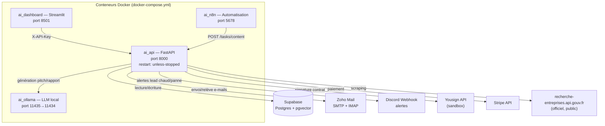

# Expertise Digitale — Dossier de présentation

*Document généré à partir d'une analyse complète du code source, du schéma Supabase, des scripts d'automatisation et des fichiers de configuration du projet `ai-company`. Toute affirmation ci-dessous est vérifiable dans le dépôt ; les points non tranchés (statut légal, tarifs définitifs) sont signalés comme tels plutôt qu'inventés.*

---

## 1. Résumé exécutif

**Expertise Digitale** est une structure d'automatisation commerciale ciblant les artisans et TPE du secteur du Bâtiment (BTP) dépourvus de présence digitale, principalement sur la Métropole de Lyon. Le système :

1. **Identifie** ces entreprises via des données publiques officielles (SIRENE),
2. **Vérifie** leur absence de site web et l'existence réelle d'un contact joignable,
3. **Sollicite** ces prospects par e-mail avec un pitch personnalisé généré par IA,
4. **Relance** automatiquement les sans-réponse selon un calendrier défini,
5. **Traite** les réponses positives (formulaire d'intake, devis, signature électronique, paiement),
6. **Livre** une prestation "Done For You" : refonte de site vitrine + SEO local + captation de devis.

Un second flux de revenu, indépendant du premier, consiste en la **revente de fichiers de prospection B2B qualifiés** (export CSV avec/sans email vérifié).

L'ensemble du pipeline — scraping, enrichissement, rédaction commerciale, envoi, relance, veille des réponses, facturation — tourne **de façon autonome et continue**, orchestré par un unique planificateur de tâches intégré à l'API.

---

## 2. Modèle économique

### 2.1 Deux offres identifiées dans le code

| Offre | Où c'est implémenté | Statut |
|---|---|---|
| **Génération de leads qualifiés** (paiement au lead ou abonnement) — c'est l'angle utilisé dans *tous* les e-mails de prospection sortants (`lead_worker.py`, pitch : "apport de clients qualifiés") | Pitch IA + envoi automatique | ✅ Actif, en cours de discussion commerciale réelle (ex. échange avec SBG Travaux) |
| **Site vitrine "Done For You" clé en main**, 990 € TTC, avec devis PDF, signature électronique (Yousign) et paiement (Stripe) | `generer_pdf_devis`, `/webhooks/yousign`, `/webhooks/stripe`, table `contracts` | ✅ Circuit technique complet et câblé, **Yousign en mode sandbox** (voir §5) |
| **Revente de fichiers de prospection B2B** (`premium_leads.csv` avec email vérifié, `base_entreprises.csv` données SIREN/adresse seules) | `export_leads_commerciaux.py` | ✅ Outil fonctionnel, filtrage par secteur/ville |

> **Point d'attention** : le pitch envoyé aux prospects ("on vous apporte des leads") et le contrat effectivement signé ("refonte de site + SEO") ne décrivent pas le même service. C'est probablement voulu (le lead-gen est l'accroche, le site vitrine avec capture de devis intégrée *est* le mécanisme qui génère ces leads pour l'artisan) — mais ça mérite d'être formulé de façon limpide dans le discours commercial pour éviter toute ambiguïté avec un client qui, comme SBG Travaux, pose des questions précises sur "paiement au contact" vs abonnement.

### 2.2 Cible et zone

Artisans du Bâtiment (gros œuvre, plâtrerie, plomberie/chauffage, etc.) sans site recensé dans les données SIRENE publiques, sur la Métropole de Lyon : Lyon 1-9e, Villeurbanne, Vénissieux, Saint-Priest, Bron, Vaulx-en-Velin, Caluire-et-Cuire, Oullins, **Rillieux-la-Pape**, Écully.

### 2.3 Tunnel de conversion réel

```
Scraping SIRENE (public, officiel)
      ↓
Vérification domaine/email/téléphone réels (anti-bounce, anti-homonyme)
      ↓
Génération pitch personnalisé (IA locale, Ollama)
      ↓
Envoi e-mail (SMTP Zoho) + pause aléatoire anti-spam
      ↓
Relance à J+4 puis J+8 si sans réponse (2 relances max, puis abandon)
      ↓
Réponse positive détectée (mots-clés) → envoi auto présentation + formulaire d'intake
      ↓
Formulaire rempli → devis PDF généré → signature électronique (Yousign)
      ↓
Paiement (lien Stripe) → webhook confirme → contrat actif
```

### 2.4 Ce que le modèle économique n'a pas encore

- **Tarif officiel figé et communiqué** : le prix du service de leads (au contact ou à l'abonnement) n'est pas défini dans le code — chaque échange commercial (ex. SBG Travaux) le négocie au cas par cas. À trancher avant scaling.
- **Politique de garantie écrite** (remplacement/avoir sur contact invalide) : logique commerciale à formaliser dans des CGV, pas encore un document existant.

---

## 3. Architecture technique réelle

### 3.1 Vue d'ensemble des services (Docker Compose)



### 3.2 Planification automatisée (interne à l'API, un seul ordonnanceur)

| Tâche | Fréquence | Fonction |
|---|---|---|
| Traitement des réponses e-mail (IMAP Zoho) | toutes les 5 min | `mail_processor.check_for_replies` |
| Traitement IA des leads (scoring + pitch) | toutes les 1 h | `lead_worker.py` |
| Campagne CEO (envoi prospection + rapport hebdo) | tous les jours à 20h | `ceo_agent.run_ceo_analysis` |
| Relances prospects sans réponse | tous les jours à 9h30 | `relance_prospects.relancer_prospects` |
| Surveillance santé (Supabase/Ollama) | toutes les 15 min | alerte Discord sur changement d'état |

*Un ancien crontab hôte faisait doublon avec ce planificateur et a été retiré ; c'est désormais l'unique source de vérité sur la cadence.*

### 3.3 Pipeline de données (scripts)

1. **`scraper_batiment.py`** — source primaire : API officielle `recherche-entreprises.api.gouv.fr` (SIRENE, gratuite, publique, sans risque de ToS). Repli PagesJaunes (fragile, disjoncteur après 6 échecs) puis, en dernier recours, un jeu de données fictif pour ne jamais bloquer le pipeline.
2. **`email_enricher.py`** — déduit et **vérifie réellement** domaine/email/téléphone (anti-homonyme : la page doit citer le nom de l'entreprise + la ville), sauvegarde `leads.json.bak` avant écrasement.
3. **`lead_worker.py`** — génère le pitch commercial par IA (Ollama `qwen2.5:7b`), déduplique par nom d'entreprise, envoie l'e-mail, upsert dans Supabase.
4. **`ceo_agent.py`** — campagne d'envoi + rapport hebdomadaire ("Market Scout") par secteur, envoyé au dirigeant par e-mail.
5. **`mail_processor.py`** — scan IMAP des non-lus, détection mots-clés positifs/négatifs, mise à jour statut, alerte Discord, déclenchement automatique de la suite (présentation + intake) sur réponse positive.
6. **`relance_prospects.py`** — 2 relances max (J+4, J+8), puis passage en `sans_reponse` (arrêt définitif, pas de sur-sollicitation).
7. **`export_leads_commerciaux.py`** — export commercial CSV (fichier prospects premium avec email vérifié / fichier base brute SIREN).
8. **`agents/workers/content_writer.py`** — génération d'articles SEO (IA + auto-amélioration si score qualité < 60), avec cache sémantique (pgvector) — alimente un axe de contenu marketing, déclenché via n8n.

### 3.4 Schéma de base de données (Supabase / Postgres)

| Table | Rôle | Statut |
|---|---|---|
| `leads` | Cœur du CRM : contact, statut, score, pitch, relances | ✅ Utilisée intensivement |
| `intake_responses` | Réponses au formulaire de qualification projet | ✅ Utilisée |
| `contracts` | Cycle de vie signature (Yousign) + paiement (Stripe) | ✅ Utilisée |
| `agent_memories` | Cache sémantique (pgvector, 768 dim) pour la génération de contenu | ✅ Utilisée |
| `tasks` | — | ⚠️ Schéma présent, usage à confirmer |
| `kpis` | MRR, leads totaux, contenus publiés, clients actifs | ❌ Table seedée à zéro, **jamais mise à jour** par le code — indicateurs morts en l'état |
| `error_log` | — | ❌ Schéma existant, aucune écriture/lecture trouvée dans le code |

Dédoublonnage des leads : clé unique sur `company` (le dédoublonnage par email a été abandonné, cf. commentaires de migration).

### 3.5 Stack technique

| Composant | Techno | Version |
|---|---|---|
| API | FastAPI + Uvicorn | 0.115.0 / 0.30.0 |
| Ordonnanceur | APScheduler | 3.10.4 |
| Base de données | Supabase (Postgres + pgvector) | client `supabase-py` 2.5.0 |
| IA locale | Ollama (self-hosted, aucun coût par requête) | modèle actif : `qwen2.5:7b` |
| Dashboard | Streamlit + pandas | 1.38.0 / 2.2.2 |
| Scraping | requests + BeautifulSoup4 | 4.14.3 |
| Signature électronique | Yousign API | **sandbox** |
| Paiement | Stripe | 10.12.0 |
| PDF | fpdf2 | 2.7.9 |
| Orchestration | Docker Compose (4 conteneurs) | — |
| Automatisation no-code | n8n | déclencheur planifié → contenu |

### 3.6 Sécurité en place

- Tous les endpoints mutants de l'API exigent un header `X-API-Key` vérifié côté serveur.
- Les webhooks Yousign et Stripe vérifient la signature de la requête (HMAC / signature Stripe) avant traitement.
- La clé Supabase `service_role` (accès total lecture/écriture) reste strictement côté serveur (API), jamais exposée au dashboard client.

---

## 4. État d'avancement — ce qui tourne réellement vs. ce qui reste à finaliser

**✅ Opérationnel et vérifié en conditions réelles :**
Scraping SIRENE, enrichissement email/téléphone, génération de pitch IA, envoi SMTP réel, veille IMAP des réponses (confirmée active en logs), relances programmées, tunnel devis → signature → paiement (câblé de bout en bout), dashboard de pilotage, génération de contenu SEO.

**⚠️ À finaliser avant mise en production complète :**
- **Yousign fonctionne en environnement sandbox** (`api-sandbox.yousign.app`) — aucune signature réalisée en sandbox n'a de valeur juridique. Bascule vers l'API production à faire avant le premier vrai contrat signé.
- Variables `DB_*` (Postgres) et `REDIS_*` présentes dans la config mais **aucun service correspondant n'existe** — bloc de configuration obsolète/vestigial, à nettoyer ou ignorer.
- Modèles Ollama `FAST`, `REASON`, `EMBED` déclarés mais non utilisés (seul `MAIN` sert actuellement) — soit à exploiter, soit à retirer de la config.
- Tables `kpis` et `error_log` : schéma présent, jamais alimenté — les indicateurs affichés nulle part ne reflètent pas l'activité réelle.
- Un **lead de test** (`__TEST_E2E_TUNNEL__`) est présent dans les données de production Supabase — à exclure de tout comptage réel et idéalement supprimer.
- Le statut d'activation réelle du workflow n8n (déclenchement quotidien de génération d'article) n'a pas pu être confirmé depuis le système de fichiers seul — à vérifier dans l'interface n8n.

---

## 5. Plan de formalisation légale

**Constat de départ, à traiter en priorité :** aucune donnée d'identité légale (raison sociale, forme juridique, SIRET, adresse de siège) n'existe nulle part dans le code ou la configuration. Le système sollicite déjà des entreprises réelles par e-mail (SBG Travaux notamment demande explicitement ces informations) — la formalisation n'est donc plus une option de confort mais une nécessité immédiate de conformité.

### 5.1 Étapes recommandées

1. **Choisir une forme juridique.** Pour une activité de prestation de services B2B démarrant seul :
   - **Micro-entreprise (auto-entrepreneur)** : simplicité maximale, mais plafond de chiffre d'affaires (77 700 € en 2026 pour les prestations de services) et pas de récupération de TVA — à évaluer selon le volume de contrats à 990 € visé.
   - **EURL / SASU** : au-delà du plafond micro, ou si levée de fonds / associés envisagés. La SASU offre un statut assimilé-salarié et plus de souplesse statutaire ; l'EURL est fiscalement plus simple à petite échelle.
2. **Immatriculation** au Guichet unique des formalités des entreprises (INPI) → obtention SIREN/SIRET, inscription au RCS.
3. **Ouverture d'un compte bancaire professionnel** dédié aux encaissements Stripe et à la facturation.
4. **Mentions légales obligatoires** à afficher sur le site et dans toute correspondance commerciale : raison sociale, forme juridique, capital social (si société), adresse du siège, SIRET, RCS, TVA intracommunautaire (si applicable), nom du responsable de publication, hébergeur.
5. **Conditions Générales de Vente (CGV)** — à rédiger formellement : elles doivent couvrir précisément ce que les prospects demandent déjà spontanément (cf. échange SBG Travaux) : tarification (au contact / abonnement), durée d'engagement, modalités de résiliation, politique de remplacement/remboursement en cas de contact invalide, délais de livraison du site vitrine.
6. **Passage de Yousign en environnement de production** (contrats juridiquement valides) une fois la structure immatriculée.
7. **RGPD / prospection commerciale (CNIL)** :
   - Les données SIRENE utilisées pour le scraping sont publiques et librement réutilisables — pas de souci de licéité sur cette source.
   - En revanche, la prospection par e-mail B2B est encadrée : le mécanisme de désinscription déjà implémenté dans `mail_processor.py` (détection "stop", "ne plus me contacter", etc. et arrêt immédiat des relances) est une bonne pratique déjà en place et va dans le sens de la conformité — à documenter formellement dans une politique de confidentialité.
   - Prévoir un registre des traitements et une politique de confidentialité publiée, notamment du fait de la fonctionnalité de revente de fichiers de prospection (`export_leads_commerciaux.py`), qui constitue un traitement de données personnelles à part entière (cession à des tiers) — point de vigilance RGPD spécifique à documenter avant toute vente de fichier.
8. **Assurance Responsabilité Civile Professionnelle (RC Pro)** — recommandée dès le premier contrat signé, notamment du fait de l'engagement de livraison (site vitrine) et du traitement de paiements clients.
9. **Facturation conforme** : dès l'immatriculation, toute facture émise (paiement Stripe) devra porter les mentions légales obligatoires (SIRET, TVA le cas échéant, mentions de pénalités de retard, etc.).

### 5.2 Urgence relative

Le point 1 → 4 (forme juridique, SIRET, mentions légales) est bloquant pour répondre honnêtement à des prospects qui, comme SBG Travaux, les demandent déjà explicitement. Le point 6 (Yousign production) est bloquant pour tout premier contrat réellement opposable. Les points RGPD sont à documenter en parallèle, sans bloquer le lancement, mais avant toute vente de fichiers à un tiers.

---

*Fin du dossier. Document basé sur l'état du dépôt au 26/07/2026 ; à mettre à jour à mesure que le statut légal se formalise et que les tarifs sont figés.*
