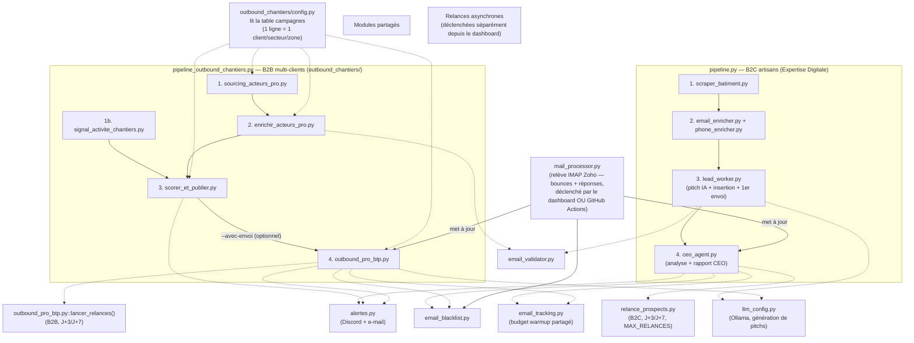

# Architecture technique — Agents & scripts du pipeline

Complète [docs/organigramme.md](organigramme.md) (structure business/juridique) avec le
détail technique réel : quelles pages du dashboard déclenchent quels scripts, et comment
les scripts s'enchaînent entre eux. Le détail des tables Supabase est dans
[architecture_donnees.md](architecture_donnees.md), celui des services externes (Zoho,
Stripe, Yousign, GitHub Actions...) dans [architecture_integrations.md](architecture_integrations.md).

> Le backend séparé `api/main.py` (FastAPI) a été supprimé : le dashboard Streamlit
> appelle directement Supabase (`dashboard/data_access.py`) et lance les scripts de fond
> en subprocess (`dashboard/process_runner.py`), plus aucune frontière réseau interne.

## 1. Dashboard → déclenchement des agents/scripts

```mermaid
flowchart TD
    subgraph DASH["Dashboard Streamlit (dashboard/app.py)"]
        PUB["pages_publiques.py\nIntake / devis / signature\n(public, sans connexion)"]
        SRC["app_pages/sourcing.py\nSourcing / Scraping"]
        GES["app_pages/gestion_clients.py\nGestion & Réponse"]
        ADM["app_pages/administration_contrats.py\nAdministration & Contrats"]
        DEL["app_pages/deliverabilite.py\nDélivrabilité"]
        SUI["app_pages/suivi_resultats.py\nSuivi & Résultats"]
        RGPD_PAGE["app_pages/suppression_rgpd.py\nSuppression RGPD"]
        PC["app_pages/portail_client.py\nPortail Client"]
    end

    PR["process_runner.py\n(lance chaque script en subprocess)"]
    SRC -->|"lancer_scraping() / lancer_pipeline_outbound()"| PR
    GES -->|"lancer_lead_worker() / lancer_ceo() / lancer_relances() / lancer_mail_check()"| PR
    SUI -.->|"relit les mêmes fonctions que sourcing/gestion"| PR

    subgraph SCRAP["Sourcing / Scraping"]
        SB["scraper_batiment.py\nPME Bâtiment (SIRENE + PagesJaunes)\nGrand Est + Métropole Lyon"]
        SAP["outbound_chantiers/\nsourcing_acteurs_pro.py\nArchitectes/promoteurs/MO (SIRENE)"]
        SIG["outbound_chantiers/\nsignal_activite_chantiers.py\nSignal chantiers par commune (Sitadel3)"]
    end

    subgraph ENRICH["Enrichissement"]
        EE["email_enricher.py\nEmail réel depuis site propre"]
        PE["phone_enricher.py\nTéléphone (Google Places, filet)"]
        EAP["outbound_chantiers/\nenrichir_acteurs_pro.py\nContact réel acteurs pro"]
    end

    subgraph SCORE["Scoring"]
        SL["scorer_leads.py\nScoring qualité leads B2C"]
        SEP["outbound_chantiers/\nscorer_et_publier.py\nScoring + publication B2B"]
    end

    subgraph ENVOI["Envoi / Campagnes"]
        LW["lead_worker.py\nPremier envoi B2C + insertion Supabase"]
        CEO["ceo_agent.py\nAnalyse, envoi prospects, rapport"]
        RP["relance_prospects.py\nRelances B2C (J+3/J+7)"]
        OPB["outbound_chantiers/\noutbound_pro_btp.py\nCampagne + relances B2B"]
    end

    subgraph SUIVI["Suivi / Délivrabilité"]
        MP["mail_processor.py\nRelève IMAP : bounces + réponses"]
        ET["email_tracking.py\nJournal envois + budget warmup"]
        EB["email_blacklist.py\nBlacklist durable"]
        EV["email_validator.py\nFiltre qualité email"]
    end

    subgraph CONTRAT["Contrats / Signature / Paiement"]
        GC["generation_contrats.py\nPDF bon de commande / CGV"]
        CS["contrats_signature.py\nDevis + Yousign + lien Stripe"]
        SI["signature_interne.py\nSignature électronique interne"]
    end

    PR --> SB & SAP & SIG
    PR --> EE & PE & EAP
    PR --> SL & SEP
    PR --> LW & CEO & RP & OPB
    PR --> MP

    ADM --> GC
    PUB -->|"formulaire intake positif"| CS
    PUB -->|"provider = interne"| SI
    GES -->|"vérif manuelle Yousign/Stripe"| CS

    RGPD_PAGE -->|"recherche + suppression"| EB
    PC -->|"signaler lead invalide"| GES

    ENVOI --> SUIVI
    SUIVI -.->|"alertes partagées"| ALERT["alertes.py\n(Discord + e-mail interne)"]
    CONTRAT -.-> ALERT
    SCORE -.-> ALERT
```

## 2. Orchestration interne des deux pipelines (B2C vs B2B)

Deux départements strictement séparés (segments commerciaux distincts, jamais mélangés en
base — voir [architecture_donnees.md](architecture_donnees.md)), avec des modules
techniques réellement partagés.

