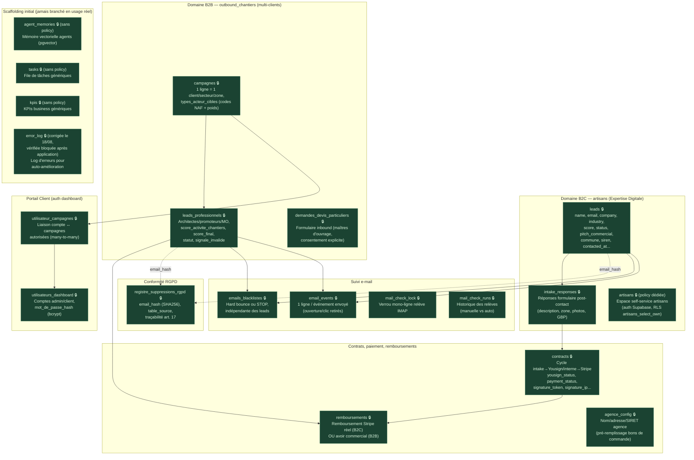
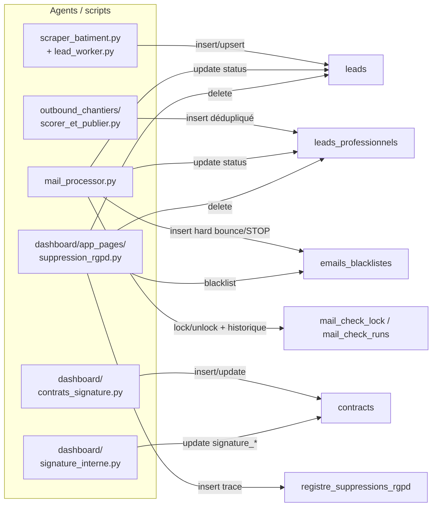

# Architecture technique — Base de données Supabase

Complète [docs/organigramme.md](organigramme.md) et [architecture_agents.md](architecture_agents.md).
Toutes les tables sont interrogées en **service_role** (clé `SUPABASE_KEY`, qui contourne
le RLS) depuis les scripts et le dashboard — seule la table `artisans` est aussi exposée
côté navigateur avec la clé **anon** publique (`landing/supabase-client.js`), ce qui rend
son RLS réellement critique. Voir [architecture_integrations.md](architecture_integrations.md)
pour le détail des deux clés.

**Statut RLS** — les 20 tables du projet ont désormais toutes été testées en conditions
réelles avec la clé anon publique et sont **protégées** (audits du 14/08/2026 et du
18/08/2026, voir `sql/fix_rls_leads_kpis.sql`, `sql/fix_rls_5_tables_restantes.sql` et
`sql/fix_rls_error_log.sql`) : 🔒 **RLS actif** — testé directement avec la clé anon
publique (lecture bloquée alors que la table contient des données réelles côté
service_role, ou test à la ligne factice pour les tables vides) ou confirmé par une
migration `ENABLE ROW LEVEL SECURITY`.

`error_log` était exposée (lisible intégralement via la clé anon, audit du 18/08/2026) ;
corrigée le jour même via `sql/fix_rls_error_log.sql`, appliquée manuellement dans
l'éditeur SQL Supabase puis revérifiée bloquée avec la même méthode.

## Qui écrit / lit quoi (principaux flux)

