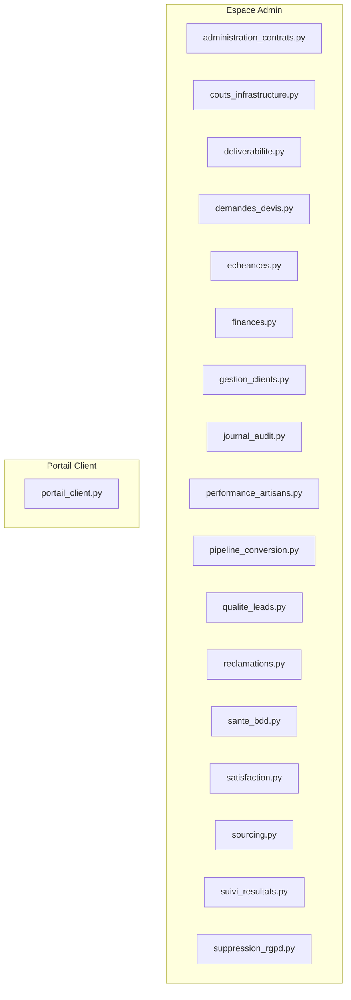

# Architecture technique globale — leads-creator

> Document généré automatiquement par `scripts/generer_architecture.py` à partir des sources de vérité réelles du projet (schéma Supabase live, `.github/workflows/*.yml`, docstrings de `dashboard/app_pages/*.py`, imports du code) — **ne pas éditer à la main**, il serait écrasé au prochain run (voir `.github/workflows/generer_architecture.yml`).

Généré le : 2026-08-29 00:36 UTC

## 1. Schéma de la base de données

31 tables, 2 vue(s) — extraites en direct via l'endpoint OpenAPI de PostgREST.

```mermaid
erDiagram
    agence_config {
        text cle PK
        text nom
        text adresse
        text email
        text siret_statut
        text siret_numero
        timestamp_with_time_zone updated_at
    }
    agent_memories {
        uuid id PK
        text agent_id
        text content
        extensions_vector_768_ embedding
        jsonb metadata
        text memory_type
        double_precision importance
        timestamp_with_time_zone created_at
    }
    articles {
        uuid id PK
        text keyword
        text content
        integer word_count
        double_precision quality_score
        uuid client_id
        text status
        timestamp_with_time_zone created_at
    }
    artisans {
        uuid id PK
        text email
        text nom_entreprise
        text nom_complet
        text siret
        text corps_metier
        timestamp_with_time_zone created_at
    }
    campagnes {
        uuid id PK
        text nom_client
        text slug
        text secteur
        text description_services
        jsonb communes_cibles
        jsonb types_acteur_cibles
        text statut
        timestamp_with_time_zone created_at
        timestamp_with_time_zone updated_at
    }
    ceo_reports {
        bigint id PK
        timestamp_with_time_zone created_at
        text title
        text content
        text summary
        text date
        text rapport
        text stats
    }
    contracts {
        uuid id PK
        uuid lead_id
        text yousign_request_id
        text yousign_status
        text stripe_payment_link_id
        text stripe_payment_url
        text payment_status
        integer montant_centimes
        timestamp_with_time_zone signed_at
        timestamp_with_time_zone paid_at
        timestamp_with_time_zone created_at
        text stripe_payment_intent_id
        text signature_provider
        text signature_token
        text signature_nom_saisi
        text signature_ip
        text signature_user_agent
        text signature_document_hash
        text signature_document_pdf_base64
        text type_offre
        text formule_abonnement
    }
    couts_infrastructure {
        uuid id PK
        text service
        integer cout_mensuel_centimes
        numeric pourcentage_du_ca
        date date_debut
        date date_fin
        text notes
        timestamp_with_time_zone created_at
    }
    demandes_devis_particuliers {
        uuid id PK
        text client_final
        text nom
        text email
        text telephone
        text commune
        text budget_estime
        text message
        boolean consentement
        text statut
        timestamp_with_time_zone created_at
        text corps_metier
        uuid lead_id_livraison
        timestamp_with_time_zone proposee_le
        timestamp_with_time_zone livree_le
        text stripe_payment_link_id
        text stripe_payment_url
        integer montant_centimes
        text stripe_payment_intent_id
        text statut_confirmation
        uuid token_confirmation
        timestamp_with_time_zone date_envoi_confirmation
        timestamp_with_time_zone date_confirmation
    }
    echeances {
        uuid id PK
        text type
        text description
        date date_echeance
        text statut
        text notes
        integer recurrence_jours
        timestamp_with_time_zone date_traitement
        timestamp_with_time_zone created_at
    }
    email_events {
        uuid id PK
        uuid tracking_id
        text type_evenement
        text lead_type
        uuid lead_id
        text client_final
        text url_cible
        timestamp_with_time_zone created_at
    }
    emails_blacklistes {
        text email PK
        text domaine
        text raison
        text code_statut
        text diagnostic
        text lead_type
        uuid lead_id
        timestamp_with_time_zone blackliste_at
    }
    error_log {
        uuid id PK
        text agent_id
        text error_type
        text error_message
        jsonb context
        boolean resolved
        timestamp_with_time_zone created_at
    }
    intake_responses {
        uuid id PK
        uuid lead_id
        text description
        text zone_activite
        timestamp_with_time_zone created_at
        text corps_metier
        text type_offre
        text formule_abonnement
        jsonb communes_couvertes
    }
    journal_audit_admin {
        uuid id PK
        uuid utilisateur_id
        text utilisateur_email
        text action
        text cible_type
        uuid cible_id
        jsonb detail
        timestamp_with_time_zone created_at
    }
    kpis {
        uuid id PK
        text metric_name
        double_precision metric_value
        timestamp_with_time_zone recorded_at
    }
    leads {
        uuid id PK
        text name
        text email
        text company
        text secteur
        text status
        integer score
        text source
        text notes
        timestamp_with_time_zone created_at
        text nom_entreprise
        text faiblesse
        text pitch
        text pitch_commercial
        text statut
        boolean contacted
        text industry
        text weakness
        text telephone
        text siren
        text adresse
        timestamp_with_time_zone contacted_at
        integer relance_count
        timestamp_with_time_zone last_relance_at
        text email_alternatif
        integer nb_delais_livraison
        timestamp_with_time_zone dernier_delai_livraison_at
        text email_status
        text commune
        text tranche_effectif_salarie
        text statut_verification_pro
        timestamp_with_time_zone date_verification
        text siret_declare
        boolean assurance_decennale_declaree
        boolean siret_verifie_sirene
        text siret_raison_sociale_sirene
    }
    leads_professionnels {
        uuid id PK
        text client_final
        text type_acteur
        text nom_entreprise
        text siren
        text commune
        text code_postal
        text adresse
        text site_web
        text email
        text telephone
        numeric score_activite_chantiers
        numeric score_final
        text statut
        boolean contacted
        timestamp_with_time_zone contacted_at
        integer relance_count
        timestamp_with_time_zone last_relance_at
        text notes
        timestamp_with_time_zone created_at
        boolean signale_invalide
        text motif_invalidite
        text linkedin_url
        jsonb reseaux_sociaux
        text enrichissement_statut
        timestamp_with_time_zone enrichi_at
        text email_alternatif
        integer nb_delais_livraison
        timestamp_with_time_zone dernier_delai_livraison_at
        text email_status
        text tranche_effectif_salarie
    }
    mail_check_lock {
        smallint id PK
        timestamp_with_time_zone locked_at
        text locked_by
    }
    mail_check_runs {
        bigint id PK
        timestamp_with_time_zone executed_at
        text source
        text statut
        integer messages_scannes
        integer bounces_total
        integer bounces_blackliste
        text erreur
    }
    migrations_appliquees {
        uuid id PK
        text nom
        timestamp_with_time_zone appliquee_le
    }
    propositions_expirees {
        uuid id PK
        uuid demande_id
        uuid artisan_id
        text corps_metier
        text commune
        integer montant_centimes
        timestamp_with_time_zone proposee_le
        timestamp_with_time_zone expire_le
    }
    reclamations {
        uuid id PK
        text type_lead
        uuid lead_id
        uuid client_lead_id
        text client_final
        text motif
        text description_libre
        timestamp_with_time_zone date_livraison_lead
        timestamp_with_time_zone date_reclamation
        boolean dans_les_delais
        text statut
        timestamp_with_time_zone date_traitement
        text traite_par
        text commentaire_traitement
        timestamp_with_time_zone created_at
    }
    registre_suppressions_rgpd {
        uuid id PK
        text email_hash
        text table_source
        timestamp_with_time_zone date_demande
        timestamp_with_time_zone date_traitement
        text traite_par
        timestamp_with_time_zone created_at
    }
    remboursements {
        uuid id PK
        uuid contract_id
        uuid lead_professionnel_id
        text client_final
        integer montant_centimes
        text motif
        text type_remboursement
        text statut
        text stripe_refund_id
        text demande_par
        timestamp_with_time_zone created_at
        timestamp_with_time_zone traite_at
    }
    sante_base_donnees {
        uuid id PK
        timestamp_with_time_zone date_controle
        text type_controle
        text statut
        jsonb detail
        timestamp_with_time_zone created_at
    }
    satisfaction_enquetes {
        uuid id PK
        uuid lead_id
        uuid contract_id
        timestamp_with_time_zone envoyee_le
        integer note
        text commentaire
        timestamp_with_time_zone repondu_le
    }
    tasks {
        uuid id PK
        text agent_id
        text task_type
        text status
        jsonb input_data
        jsonb output_data
        double_precision quality_score
        integer tokens_used
        timestamp_with_time_zone created_at
        timestamp_with_time_zone completed_at
    }
    utilisateur_campagnes {
        uuid utilisateur_id PK
        text client_final PK
    }
    utilisateur_leads {
        uuid utilisateur_id PK
        uuid lead_id PK
    }
    utilisateurs_dashboard {
        uuid id PK
        text email
        text mot_de_passe_hash
        text role
        boolean actif
        timestamp_with_time_zone created_at
    }
    leads ||--o{ contracts : "lead_id"
    leads ||--o{ demandes_devis_particuliers : "lead_id_livraison"
    leads ||--o{ intake_responses : "lead_id"
    utilisateurs_dashboard ||--o{ journal_audit_admin : "utilisateur_id"
    demandes_devis_particuliers ||--o{ propositions_expirees : "demande_id"
    leads ||--o{ propositions_expirees : "artisan_id"
    leads ||--o{ reclamations : "client_lead_id"
    contracts ||--o{ remboursements : "contract_id"
    leads_professionnels ||--o{ remboursements : "lead_professionnel_id"
    leads ||--o{ satisfaction_enquetes : "lead_id"
    contracts ||--o{ satisfaction_enquetes : "contract_id"
    utilisateurs_dashboard ||--o{ utilisateur_campagnes : "utilisateur_id"
    utilisateurs_dashboard ||--o{ utilisateur_leads : "utilisateur_id"
    leads ||--o{ utilisateur_leads : "lead_id"
```

**Vues** (non représentées dans le diagramme ci-dessus, lecture seule) :

- `v_policies_rls`
- `v_score_vs_conversion_pro`

## 2. Pipelines et automatisations

```mermaid
flowchart LR
    subgraph CRON["GitHub Actions (cron)"]
        ceo_agent_yml["Campagne de prospection B2C (ceo_agent)<br/>(20 6 * * *)"] --> ceo_agent_yml_script(["ceo_agent.py"])
        controle_delivrabilite_yml["Contrôle hebdomadaire de la délivrabilité e-mail<br/>(0 9 * * 1)"] --> controle_delivrabilite_yml_script(["scripts/controle_delivrabilite.py"])
        controle_echeances_yml["Contrôle hebdomadaire des échéances<br/>(0 8 * * 1)"] --> controle_echeances_yml_script(["scripts/controle_echeances.py"])
        controle_sante_bdd_yml["Contrôle de santé de la base de données<br/>(30 4 * * *)"] --> controle_sante_bdd_yml_script(["scripts/controle_sante_bdd.py"])
        envoyer_enquetes_satisfaction_yml["Envoi quotidien des enquêtes de satisfaction<br/>(0 5 * * *)"] --> envoyer_enquetes_satisfaction_yml_script(["scripts/envoyer_enquetes_satisfaction.py"])
        livraison_devis_yml["Réattribution automatique des demandes de devis expirées<br/>(15 * * * *)"] --> livraison_devis_yml_script(["livraison_devis.py"])
        mail_check_yml["Relève automatique des mails (bounces / réponses)<br/>(0 * * * *)"] --> mail_check_yml_script(["mail_processor.py"])
        outbound_chantiers_campagne_yml["Campagne et relances quotidiennes B2B (outbound_chantiers)<br/>(30 9 * * *)"] --> outbound_chantiers_campagne_yml_script(["scripts/lancer_pipeline_b2b.py"])
        outbound_chantiers_sourcing_yml["Sourcing hebdomadaire B2B (outbound_chantiers)<br/>(30 6 * * 1)"] --> outbound_chantiers_sourcing_yml_script(["scripts/lancer_pipeline_b2b.py"])
        relance_prospects_yml["Relance quotidienne des prospects B2C sans réponse<br/>(40 6 * * *)"] --> relance_prospects_yml_script(["relance_prospects.py"])
    end
    subgraph SYNC["Déclenchement synchrone (pas de cron)"]
        sync_0["Confirmation par e-mail d'une demande de devis"]
    end
```

### Déclenchées par cron (GitHub Actions)

| Workflow | Fréquence | Script | Rôle |
|---|---|---|---|
| `ceo_agent.yml` | `20 6 * * *` | `ceo_agent.py` | Exécute ceo_agent.py quotidiennement — envoie un pitch RÉGÉNÉRÉ (voir lead_worker.py::generer_pitch(), jamais le pitch_commercial mis en cache au scraping) à chaque lead B2C non contacté dont l'email a été réellement vérifié (voir ceo_agent.py::get_leads_from_supabase). Journalise le résultat de la campagne dans la table ceo_reports. |
| `controle_delivrabilite.yml` | `0 9 * * 1` | `scripts/controle_delivrabilite.py` | Exécute scripts/controle_delivrabilite.py une fois par semaine — alerte (Discord ou e-mail en repli) si le taux de hard bounce dépasse 5 % sur les 30 derniers jours, sur les artisans ou le B2B (voir dashboard/data_access.py::get_taux_bounce). |
| `controle_echeances.yml` | `0 8 * * 1` | `scripts/controle_echeances.py` | Exécute scripts/controle_echeances.py une fois par semaine — alerte (Discord ou e-mail en repli) sur toute échéance légale/administrative encore 'a_traiter' à moins de 30 jours (voir sql/init_echeances.sql). |
| `controle_sante_bdd.yml` | `30 4 * * *` | `scripts/controle_sante_bdd.py` | Exécute scripts/controle_sante_bdd.py quotidiennement — sécurité (couverture RLS, fonctions exposées), opérationnel (demandes de devis bloquées, réclamations en retard) et dérive (croissance anormale, données de test résiduelles, FK non indexées). Objectif : détecter une régression avant qu'un utilisateur ou un test manuel ne la découvre par hasard (voir sql/init_demandes_devis_particuliers_confirmation.sql pour l'incident qui a motivé ce système). |
| `envoyer_enquetes_satisfaction.yml` | `0 5 * * *` | `scripts/envoyer_enquetes_satisfaction.py` | Exécute scripts/envoyer_enquetes_satisfaction.py une fois par jour — envoie une enquête de satisfaction aux artisans dont le premier paiement date d'environ une semaine (voir sql/init_satisfaction_enquetes.sql). |
| `livraison_devis.yml` | `15 * * * *` | `livraison_devis.py` | Exécute livraison_devis.py à intervalle régulier, indépendamment du dashboard Streamlit Community Cloud (qui n'a ni cron ni garantie de rester éveillé) — sans ce déclenchement automatique, l'engagement de délai affiché publiquement ("un professionnel qualifié vous recontacte sous 48h maximum, ou votre demande est automatiquement proposée à un autre professionnel", voir dashboard/pages_publiques.py) ne serait vrai que si un admin pense à cliquer le bouton manuel du dashboard au bon moment — pas une vraie garantie. |
| `mail_check.yml` | `0 * * * *` | `mail_processor.py` | Exécute mail_processor.py à intervalle régulier, indépendamment du dashboard Streamlit Community Cloud (qui n'a ni cron ni garantie de rester éveillé) — voir mail_processor.py::check_for_replies pour le verrou partagé (table Supabase mail_check_lock) qui empêche ce run automatique de se chevaucher avec un clic simultané sur le bouton manuel "Vérifier mails" du dashboard. |
| `outbound_chantiers_campagne.yml` | `30 9 * * *` | `scripts/lancer_pipeline_b2b.py` | Exécute scripts/lancer_pipeline_b2b.py --envoi-seul quotidiennement, pour CHAQUE campagne active (table campagnes, statut='active') — module 4 d'outbound_chantiers.pipeline_outbound_chantiers seul (outbound_pro_btp.py) : contacte les nouveaux acteurs jamais sollicités ET relance ceux dont l'échéance J+3/J+7 est atteinte, dans la même passe (voir outbound_chantiers/n8n_workflow_outbound_chantiers.md, Workflow B — les deux fonctions gèrent déjà en interne le cas où rien n'est éligible ce jour-là). |
| `outbound_chantiers_sourcing.yml` | `30 6 * * 1` | `scripts/lancer_pipeline_b2b.py` | Exécute scripts/lancer_pipeline_b2b.py (sourcing seul, sans --envoi-seul) une fois par semaine, pour CHAQUE campagne active (table campagnes, statut='active') — modules 1-3 d'outbound_chantiers.pipeline_outbound_chantiers : sourcing des acteurs pro, filtrage/enrichissement du contact réel, scoring + publication en base. |
| `relance_prospects.yml` | `40 6 * * *` | `relance_prospects.py` | Exécute relance_prospects.py quotidiennement — relance les leads B2C contactés sans réponse après DELAI_PREMIERE_RELANCE_JOURS (4j par défaut), puis DELAI_RELANCE_SUIVANTE_JOURS (4j) après la relance précédente ; au-delà de MAX_RELANCES (2), le lead passe "sans_reponse" et n'est plus recontacté. |

### Déclenchées de façon synchrone (pas de cron)

- **Confirmation par e-mail d'une demande de devis** (`dashboard/pages_publiques.py`) — Envoyée directement au dépôt du formulaire public (afficher_demande_devis / afficher_intake), PAS par cron — voir sql/init_demandes_devis_particuliers_confirmation.sql. Le rapprochement round-robin qui suit, lui, reste piloté par livraison_devis.yml (cron horaire).

## 3. Pages et rôles du dashboard

| Page | Espace | Rôle |
|---|---|---|
| `administration_contrats.py` | Admin | Interface "Administration & Contrats" — génération d'un document contractuel (bon de commande / contrat de prestation) pré-rempli avec les informations d'un client de l'agence, quel qu'il soit, prêt à copier ou télécharger en PDF. Le PDF intègre directement le corps des Conditions Générales de Prestation (CGV) de l'agence : le document généré est prêt à être envoyé tel quel à un client (ex. S.B.G Travaux) avec le devis ou le bon de commande. |
| `couts_infrastructure.py` | Admin | Interface admin "Coûts d'infrastructure" — module 3 de pilotage. Coûts remplis manuellement (pas d'API de facturation branchée dans un premier temps, voir sql/init_couts_infrastructure.sql) : Supabase, Streamlit Cloud, Zoho, futur nom de domaine, frais Stripe (en pourcentage du CA réel, pas un montant fixe). |
| `deliverabilite.py` | Admin | Interface "Délivrabilité" — suivi de la montée en charge progressive (warmup) du domaine d'envoi B2B, taux de réponse, taux de hard bounce (module 7 de pilotage — alerte hebdomadaire automatique, voir scripts/controle_delivrabilite.py) et vérification live des enregistrements DNS (SPF/DKIM/DMARC) indispensables à la délivrabilité. |
| `demandes_devis.py` | Admin | Interface "Demandes de devis" — suivi du mécanisme de livraison qui rapproche les demandes publiques (formulaire générique /demande-devis, voir dashboard/pages_publiques.py::afficher_demande_devis) avec les artisans clients actifs (leads.status='paye'), voir livraison_devis.py pour la logique complète (round-robin, quota abonnement, proposition/paiement à l'unité, expiration à 48h). Conception validée le 18/08/2026. |
| `echeances.py` | Admin | Interface admin "Échéances" — module 5 de pilotage. Échéances légales et administratives (statut légal définitif, renouvellement nom de domaine, validité assurance décennale — voir sql/init_echeances.sql pour pourquoi aucune de ces trois n'a de date insérée automatiquement) + vérification récurrente de l'usage Supabase (fusion du module 11, voir la migration). |
| `finances.py` | Admin | Interface "Finances" — chiffre d'affaires, MRR et activité commerciale dans le temps (24h / 7j / 30j / total). |
| `gestion_clients.py` | Admin | Interface "Gestion & Réponse aux clients" — suivi des leads, visualisation des scores, et pilotage des campagnes d'e-mailing / relances, filtrable par client/campagne (plateforme multi-clients / multi-secteurs). |
| `journal_audit.py` | Admin | Interface admin "Journal d'audit" — historique consultable/filtrable des actions admin sensibles (voir sql/init_journal_audit_admin.sql, data_access.journaliser_action_admin). Branché directement dans les fonctions existantes qui font déjà ces actions (traiter_reclamation, maj_statut_verification_pro, marquer_contrat_signe, marquer_contrat_paye, executer_remboursement) — pas un système de log séparé. |
| `performance_artisans.py` | Admin | Interface admin "Performance artisans" — module 9 de pilotage. Par artisan (formule à l'unité uniquement — la formule abonnement livre directement, aucune notion de refus/expiration) : propositions expirées sans action (table propositions_expirees, voir sql/init_propositions_expirees.sql et livraison_devis.py::expirer_propositions_perimees), livraisons payées, taux de réactivité déduit, délai moyen de paiement. |
| `pipeline_conversion.py` | Admin | Interface admin "Pipeline de conversion" — module 2 de pilotage. Répartition des leads par statut actuel (B2C et B2B) + taux de contact/intérêt/signature dérivés — voir data_access.get_pipeline_conversion pour le détail de la limite importante : c'est une PHOTO de l'état courant, pas un entonnoir de cohorte (leads.status/statut est écrasé à chaque changement d'étape, aucun historique en base). |
| `portail_client.py` | Client | Portail Client — vue en lecture seule, strictement limitée aux campagnes B2B (dashboard/auth.py::campagnes_autorisees()) et/ou aux leads B2C (dashboard/auth.py::mes_leads_autorises(), voir sql/init_utilisateur_leads.sql) de l'utilisateur connecté. Un même compte peut être lié à l'un, l'autre, ou les deux — chaque section ci-dessous ne s'affiche que si le compte a quelque chose à y voir. |
| `qualite_leads.py` | Admin | Interface admin "Qualité des leads" — module 8 de pilotage. Score global + détail actionnable : doublons potentiels (leads/leads_professionnels), champs manquants sur les leads actifs (surtout l'e-mail, seul canal de prospection utilisé par ce projet), pourcentage de leads pro jamais enrichis depuis trop longtemps. |
| `reclamations.py` | Admin | Interface admin "Réclamations" — traitement des réclamations Article 4 des CGV (construire_articles_cgv_b2c et son équivalent B2B), B2C et B2B confondues (voir sql/init_reclamations.sql, dashboard/data_access.py). |
| `sante_bdd.py` | Admin | Interface admin "Santé de la base" — vue du système de surveillance continue de Supabase (voir sql/init_sante_base_donnees.sql, scripts/controle_sante_bdd.py, .github/workflows/controle_sante_bdd.yml, cron quotidien). Objectif : rendre visible ici ce que le cron détecte déjà tout seul (RLS manquant, demandes de devis bloquées, réclamations en retard...) plutôt que de le découvrir par hasard lors d'un test manuel — voir sql/init_demandes_devis_particuliers_confirmation.sql pour l'incident qui a motivé ce système. |
| `satisfaction.py` | Admin | Interface admin "Satisfaction" — module 4 de pilotage. Enquêtes envoyées automatiquement 1 semaine après le premier paiement d'un artisan (voir scripts/envoyer_enquetes_satisfaction.py, sql/init_satisfaction_enquetes.sql). |
| `sourcing.py` | Admin | Interface "Sourcing / Scraping" — recherche de futurs clients ET configuration des campagnes (plateforme multi-clients / multi-secteurs). |
| `suivi_resultats.py` | Admin | Interface "Suivi et Résultats des Actions" — vue centralisée du statut, des logs et de l'historique de chaque action de fond (scraping, traitement IA, campagnes, relances, vérification IMAP), déclenchées en subprocess par process_runner.py (voir sa docstring). |
| `suppression_rgpd.py` | Admin | [Admin] Suppression RGPD — droit à l'effacement (art. 17 RGPD). |

## 4. Intégrations externes

Détectées par recherche des imports/appels réels dans le code (pas une liste maintenue à la main).

| Service | Rôle dans le projet | Utilisé dans |
|---|---|---|
| Supabase (Postgres + Auth) | Base de données applicative (toutes les tables métier) et authentification native pour l'espace Artisans (landing/). Accès serveur exclusivement via la clé service_role (bypass RLS). | `ceo_agent.py`, `dashboard/supabase_client.py`, `livraison_devis.py`, `mail_processor.py`, `relance_prospects.py`, … (+2) |
| Stripe | Lien de paiement (Payment Links) généré à la signature du contrat B2C, et remboursements (Refunds API). Confirmation de paiement 100% manuelle côté admin (pas de webhook). | `dashboard/contrats_signature.py`, `dashboard/data_access.py`, `livraison_devis.py` |
| Zoho Mail (SMTP/IMAP) | Envoi des campagnes/relances/e-mails transactionnels (SMTP) et relève des bounces/réponses (IMAP). | `alertes.py`, `mail_processor.py`, `outbound_chantiers/outbound_pro_btp.py` |
| Signature électronique interne | Provider de signature par défaut (art. 1367 code civil, lien token + preuve IP/user-agent). | `alertes.py`, `dashboard/app_pages/gestion_clients.py`, `dashboard/contrats_signature.py`, `dashboard/pages_publiques.py`, `dashboard/signature_interne.py`, … (+1) |
| Yousign | Provider de signature électronique alternatif (sandbox), activable via SIGNATURE_PROVIDER_PAR_DEFAUT. | `dashboard/app_pages/gestion_clients.py`, `dashboard/contrats_signature.py`, `dashboard/data_access.py`, `dashboard/finances_calc.py`, `dashboard/pages_publiques.py`, … (+1) |
| API SIRENE (recherche-entreprises.api.gouv.fr) | Recherche/enrichissement d'entreprises (SIREN, adresse) — données publiques, sans clé. | `outbound_chantiers/config.py`, `outbound_chantiers/sourcing_acteurs_pro.py`, `phone_enricher.py`, `scraper_batiment.py`, `verification_pro.py` |
| Google Places API | Dernier recours pour trouver un téléphone d'entreprise (payant) — voir phone_enricher.py. | `outbound_chantiers/enrichir_acteurs_pro.py`, `phone_enricher.py` |
| DNS-over-HTTPS (dns.google) | Vérification live des enregistrements SPF/DKIM/DMARC (app_pages/deliverabilite.py), gratuit. | `dashboard/app_pages/deliverabilite.py` |
| Discord (webhook) | Alertes temps réel (lead ultra-qualifié, erreurs) — voir alertes.py. | `alertes.py`, `dashboard/data_access.py`, `mail_processor.py`, `scraper_batiment.py`, `scripts/controle_delivrabilite.py`, … (+2) |
| Ollama | Génération des pitchs de prospection (LLM local, avec repli générique si injoignable). | `dashboard/data_access.py`, `lead_worker.py`, `llm_config.py`, `outbound_chantiers/config.py` |
| GitHub Actions | Seul déclencheur cron du projet (Streamlit Community Cloud n'a pas de cron) — voir section 2 | `ceo_agent.yml`, `controle_delivrabilite.yml`, `controle_echeances.yml`, `controle_sante_bdd.yml`, `envoyer_enquetes_satisfaction.yml`, `livraison_devis.yml`, `mail_check.yml`, `outbound_chantiers_campagne.yml`, `outbound_chantiers_sourcing.yml`, `relance_prospects.yml` |

## 5. Surveillance continue de la base

Un contrôle de santé automatisé (`scripts/controle_sante_bdd.py`) tourne quotidiennement (30 4 * * *, UTC) et vérifie la couverture RLS, les fonctions SECURITY DEFINER exposées, les demandes de devis bloquées, les réclamations en retard, les erreurs non résolues, la croissance anormale des tables, les données de test résiduelles et les FK non indexées — objectif : détecter une régression avant qu'un utilisateur ou un test manuel ne la découvre par hasard.

- Historique complet des contrôles : table `sante_base_donnees`.
- Vue dashboard (statut, tendance 30 jours, actions à prendre) : `dashboard/app_pages/sante_bdd.py` (espace admin).
- Déclenchement automatique : `.github/workflows/controle_sante_bdd.yml`.

## 6. Modules de pilotage (économique, opérationnel, qualité)

Chantier en cours (27/08/2026) : 12 modules de pilotage complétant la surveillance technique (section 5) — construits un par un, chacun avec sa table Supabase (RLS actif) et sa page dashboard admin dédiée.

- **Module 10 — Journal d'audit admin** (27/08/2026) : chaque action admin sensible (traiter une réclamation, changer un statut de vérification pro, marquer un contrat signé/payé, exécuter un remboursement) est tracée dans `journal_audit_admin` — voir `data_access.journaliser_action_admin`, page `dashboard/app_pages/journal_audit.py`.
- **Module 3 — Coûts d'infrastructure** (27/08/2026) : coûts remplis manuellement (`couts_infrastructure`, montant fixe ou % du CA) comparés au CA réel du mois (`data_access.calculer_ca_du_mois`, réutilisable par le futur module 1 finances) — page `dashboard/app_pages/couts_infrastructure.py`.
- **Module 8 — Qualité des leads** (27/08/2026) : score global calculé à la volée (`data_access.score_qualite_leads`, pas de table dédiée) — doublons potentiels (téléphone/SIREN/nom normalisé, scopés par campagne côté B2B), champs manquants sur les leads actifs (e-mail en priorité, seul canal de prospection), enrichissement B2B stagnant. Page `dashboard/app_pages/qualite_leads.py` + script CLI/cron optionnel `scripts/controle_qualite_leads.py`.
- **Module 5 — Échéances légales/administratives** (27/08/2026) : table `echeances` (récurrence optionnelle, ex. vérification mensuelle de l'usage Supabase — fusion du module 11, son API de gestion étant inaccessible avec `SUPABASE_KEY`), alerte hebdomadaire (`scripts/controle_echeances.py`, `.github/workflows/controle_echeances.yml`, lundi 8h UTC) sur toute échéance à moins de 30 jours — page `dashboard/app_pages/echeances.py`.
- **Module 7 — Qualité et délivrabilité e-mail** (27/08/2026) : taux de hard bounce sur 30 jours glissants (`data_access.get_taux_bounce`, aucune nouvelle table — réutilise `email_events` et `emails_blacklistes`), ajouté à la page existante `dashboard/app_pages/deliverabilite.py` (déjà warmup + taux de réponse + DNS), alerte hebdomadaire si le taux dépasse 5 % (`scripts/controle_delivrabilite.py`, `.github/workflows/controle_delivrabilite.yml`, lundi 9h UTC). Pas de suivi ouverture/clic : le pixel de tracking a été retiré.
- **Module 1 — Finances** (27/08/2026) : CA/MRR/répartitions B2C déjà entièrement construits (`dashboard/app_pages/finances.py`, `finances_calc.py`, `data_access.get_contracts_finances`) mais retirés de la navigation le 17/08 sur suspicion d'ImportError en production — réactivés après retest en réel contre la prod n'ayant rien reproduit (décalage de cache Streamlit Cloud, pas un bug de code). B2B hors périmètre : aucune facturation B2B persistée en base à ce jour.
- **Module 2 — Pipeline de conversion** (27/08/2026) : répartition B2C/B2B par statut actuel + taux de contact/intérêt/signature (`data_access.get_pipeline_conversion`, aucune nouvelle table). Photo de l'état courant, pas une cohorte temporelle — leads.status/leads_professionnels.statut sont écrasés à chaque changement d'étape, aucun historique en base (approche confirmée par l'utilisateur). Pas d'alerte automatique : pas de seuil "anormalement bas" fiable sur le volume actuel. Page `dashboard/app_pages/pipeline_conversion.py`.
- **Module 9 — Performance des artisans** (27/08/2026) : formule à l'unité uniquement. Table `propositions_expirees` (voir sql/init_propositions_expirees.sql) journalise chaque proposition expirée sans action — nécessite une petite modification de `livraison_devis.py::expirer_propositions_perimees()` (une info calculée puis jetée à chaque run devient persistée). Combinée aux livraisons payées (`data_access.get_performance_artisans`) : taux de réactivité et délai moyen de paiement par artisan — page `dashboard/app_pages/performance_artisans.py`.
- **Module 4 — Satisfaction client** (27/08/2026) : enquête envoyée automatiquement 1 semaine après le premier paiement d'un artisan (`scripts/envoyer_enquetes_satisfaction.py`, `.github/workflows/envoyer_enquetes_satisfaction.yml`, quotidien 5h UTC) — table `satisfaction_enquetes` (voir sql/init_satisfaction_enquetes.sql). Réponse saisie manuellement par un admin (pas de webhook/formulaire public — la réponse arrive par e-mail) : page `dashboard/app_pages/satisfaction.py`.
- **Module 6 — Acquisition** : en attente (27/08/2026) — aucune colonne "canal d'acquisition" n'est actuellement remplie en base (`leads.source` existe mais n'est jamais écrit par le scraper). Nécessiterait d'instrumenter un nouveau point de capture (ex. champ dans le formulaire d'intake public) qui n'existe pas encore — décision explicite de l'utilisateur de reporter plutôt que d'inventer une source non fiable.
- **Module 12 — Trafic du site vitrine** : en attente (dépendance externe, nom de domaine pas encore acheté) — volontairement non construit.
