# Architecture technique — Intégrations externes

Complète [docs/organigramme.md](organigramme.md), [architecture_agents.md](architecture_agents.md)
et [architecture_donnees.md](architecture_donnees.md).

```mermaid
flowchart TD
    subgraph CORE["Cœur applicatif"]
        DASH["Dashboard Streamlit\n(dashboard/)"]
        SCRIPTS["Scripts de fond\n(racine + outbound_chantiers/)"]
    end

    subgraph SUPA["Supabase"]
        PG["Postgres\n(toutes les tables métier)"]
    end
    DASH -->|"clé service_role\n(SUPABASE_KEY, bypass RLS)"| PG
    SCRIPTS -->|"clé service_role"| PG
    SCRIPTS -->|"clé anon publique\n(SUPABASE_ANON_KEY, test RLS)"| PG

    subgraph ZOHO["Zoho Mail"]
        SMTP["SMTP\n(envoi campagnes/relances)"]
        IMAP["IMAP\n(relève bounces + réponses)"]
    end
    SCRIPTS -->|"ceo_agent.py, relance_prospects.py,\noutbound_pro_btp.py, alertes.py"| SMTP
    SCRIPTS -->|"mail_processor.py\n(parsing DSN)"| IMAP

    subgraph GHA["GitHub Actions"]
        CRON["mail_check.yml\ncron horaire (0 * * * *)"]
    end
    CRON -->|"python3 mail_processor.py\n(secrets injectés en env)"| IMAP
    CRON -->|"verrou partagé"| PG
    DASH -.->|"bouton manuel 'Vérifier mails'\n(même script, même verrou)"| IMAP

    subgraph STRIPE["Stripe"]
        PAYLINK["Payment Links\n(lien de paiement, usage unique)"]
        REFUND["Refunds API"]
        WEBHOOK["Webhook\ncheckout.session.completed"]
    end
    DASH -->|"contrats_signature.py::creer_et_envoyer_lien_paiement()\nlivraison_devis.py::_proposer()"| PAYLINK
    DASH -->|"data_access.py::executer_remboursement()\n(type_remboursement='stripe')"| REFUND
    WEBHOOK -->|"vérifie la signature,\nfile d'attente"| EDGEFN["Supabase Edge Function\nstripe-webhook/"]
    EDGEFN -->|"insert (dédoublonné)"| PG
    CRON2["GitHub Actions\ntraiter_paiements_stripe.yml\n(*/10 * * * *)"] -->|"scripts/traiter_paiements_stripe.py\nconsomme stripe_webhook_events"| PG

    subgraph SIGN["Signature électronique"]
        YOUSIGN["Yousign\n(sandbox — non valable légalement\nau 10/08, conservé réactivable)"]
        INTERNE["Signature interne\n(art. 1367 code civil,\nlien token + preuve IP/user-agent)"]
    end
    DASH -->|"contrats_signature.py\n(SIGNATURE_PROVIDER_PAR_DEFAUT)"| YOUSIGN
    DASH -->|"signature_interne.py\n(provider par défaut actuel)"| INTERNE
    DASH -.->|"confirmation signature 100% MANUELLE\n(pas de webhook Yousign)"| YOUSIGN

    subgraph GOOGLE["APIs Google"]
        PLACES["Google Places API\n(fallback téléphone, payant)"]
        DNSGOOGLE["DNS-over-HTTPS\n(dns.google/resolve, gratuit)"]
    end
    SCRIPTS -->|"phone_enricher.py"| PLACES
    DASH -->|"app_pages/deliverabilite.py\n(vérif SPF/DKIM/DMARC live)"| DNSGOOGLE

    subgraph GOUV["Données publiques françaises"]
        SIRENE["API SIRENE\n(recherche-entreprises.api.gouv.fr,\ngratuite, sans clé)"]
        DIDO["API Dido / SDES Sitadel3\n(permis de construire agrégés\npar commune, sans clé)"]
    end
    SCRIPTS -->|"scraper_batiment.py,\nsourcing_acteurs_pro.py"| SIRENE
    SCRIPTS -->|"signal_activite_chantiers.py\n(jamais de donnée nominative)"| DIDO

    subgraph LLM_EXT["LLM"]
        OLLAMA["Ollama\n(local, génération de pitchs)"]
    end
    SCRIPTS -->|"llm_config.py\n(lead_worker.py, outbound_pro_btp.py)"| OLLAMA

    subgraph ALERTING["Alerting"]
        DISCORD["Discord\n(webhook)"]
        MAILINT["E-mail interne\n(CEO_EMAIL, via SMTP Zoho)"]
    end
    SCRIPTS -->|"alertes.py"| DISCORD
    SCRIPTS -->|"alertes.py"| MAILINT
```

## Notes de lecture

- **Deux clés Supabase bien distinctes** : `SUPABASE_KEY` (service_role, utilisée
  partout côté serveur — dashboard et scripts) contourne le RLS par conception Supabase ;
  `SUPABASE_ANON_KEY` (publique par design, sans risque à exposer) ne peut lire/écrire que
  ce que le RLS autorise explicitement — utilisée uniquement par
  `scripts/controle_sante_bdd.py::_cle_anon()` pour tester la couverture RLS avec le même
  rôle qu'un visiteur non authentifié (05/09/2026 : anciennement lue depuis
  `landing/supabase-client.js`, avant la suppression de l'espace Artisans en auto-inscription,
  reliquat de l'ancien modèle "site vitrine" jamais relié au pipeline `leads` actuel — voir
  `sql/init_artisans.sql`). Voir [architecture_donnees.md](architecture_donnees.md)
  pour le statut RLS de chaque table.
- **Ancien backend FastAPI (`api/main.py`) supprimé** : le webhook Yousign qui y était défini
  n'existe plus — la confirmation de signature reste **manuelle**, vérifiée par l'admin puis
  actée dans le dashboard. Le webhook Stripe, lui, est de nouveau automatisé, mais via une
  Supabase Edge Function (`supabase/functions/stripe-webhook/`) plutôt que ce backend, avec
  `scripts/traiter_paiements_stripe.py` (cron toutes les 10 min) qui consomme la file
  `stripe_webhook_events` qu'elle remplit.
- **GitHub Actions est le seul déclencheur non-Streamlit** du projet : nécessaire car
  Streamlit Community Cloud n'a ni cron ni garantie de rester éveillé ; coordonné avec le
  bouton manuel du dashboard via le verrou Supabase `mail_check_lock`.
