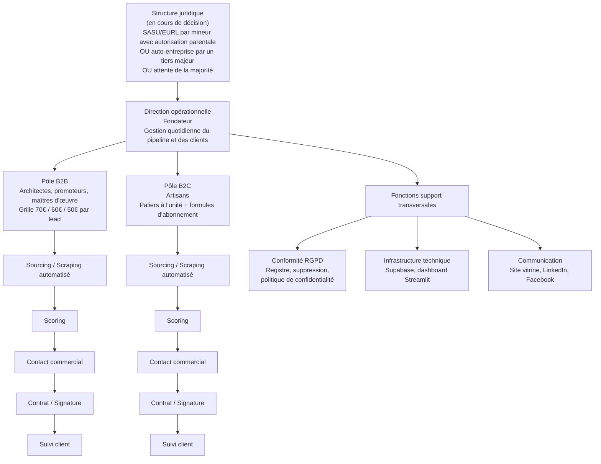

# Organigramme d'Expertise Digitale

```mermaid
graph TD
    LEGAL["Structure juridique\n(en cours de décision)\nSASU/EURL par mineur avec autorisation parentale\nOU auto-entreprise par un tiers majeur\nOU attente de la majorité"]
    DIR["Direction opérationnelle\nFondateur\nGestion quotidienne du pipeline et des clients"]

    LEGAL --> DIR

    DIR --> B2B["Pôle B2B\nArchitectes, promoteurs, maîtres d'œuvre\nGrille 70€ / 60€ / 50€ par lead"]
    DIR --> B2C["Pôle B2C\nArtisans\nPaliers à l'unité + formules d'abonnement"]
    DIR --> SUP["Fonctions support transversales"]

    B2B --> B2B1["Sourcing / Scraping automatisé"]
    B2B1 --> B2B2["Scoring"]
    B2B2 --> B2B3["Contact commercial"]
    B2B3 --> B2B4["Contrat / Signature"]
    B2B4 --> B2B5["Suivi client"]

    B2C --> B2C1["Sourcing / Scraping automatisé"]
    B2C1 --> B2C2["Scoring"]
    B2C2 --> B2C3["Contact commercial"]
    B2C3 --> B2C4["Contrat / Signature"]
    B2C4 --> B2C5["Suivi client"]

    SUP --> RGPD["Conformité RGPD\nRegistre, suppression,\npolitique de confidentialité"]
    SUP --> INFRA["Infrastructure technique\nSupabase, dashboard Streamlit"]
    SUP --> COM["Communication\nSite vitrine, LinkedIn, Facebook"]
```
